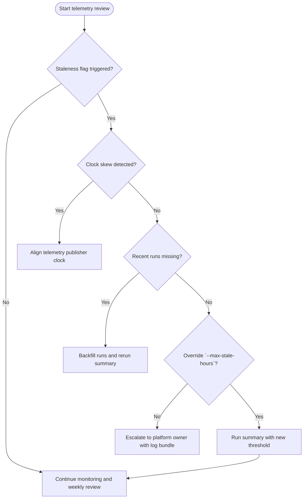

# Font Telemetry Staleness Guardrails

## Tuning quickstart



1. Start with the latest telemetry snapshot (default: `artifacts/logs/headless-font-health.json`).
2. If staleness triggers, verify clock alignment on the telemetry publisher first.
3. Confirm minimum run counts meet expectations before relaxing thresholds.
4. Keep overrides short-lived and record rationale in the backlog.

## CLI override scenarios

Use `scripts/font_health_summary.py` to inspect telemetry with explicit staleness windows.

```bash
python -m scripts.font_health_summary artifacts/logs/headless-font-health.json \
  --max-stale-hours 4
```

When validating a temporary extension alongside other tolerance changes:

```bash
python -m scripts.font_health_summary artifacts/logs/headless-font-health.json \
  --max-stale-hours 12 \
  --max-failure-rate 0.15 \
  --allow-last-failure
```

All overrides are logged in structured staleness events so reviewers can audit the context.

## Structured staleness events

Running the summary now writes JSON logs to `artifacts/logs/font-staleness/` (override with
`FONT_STALENESS_LOG_DIR` or `--log-dir`). Each file is named `font-staleness-<UTC timestamp>.json`
and includes:

- CLI guardrail configuration (`maxFailureRate`, `maxLastUpdatedAgeSeconds`, etc.).
- Scenario evaluations with status, issues, and computed `lastUpdatedAgeSeconds`.
- Missing scenario names and whether the run surfaced any issues.

Use `--max-log-files <count>` to prune older event files after each run when local storage or
artifact retention needs to stay within a fixed window. Passing `0` deletes the event log that was
just written (the aggregated summary remains) so that operators can rely solely on the summary
snapshot when necessary.

When retention should be based on age rather than count, pass `--max-log-age-hours <hours>`.
DriftBuster prunes any structured event logs older than the supplied window while keeping the
fresh summary snapshot in place. Combine the count and age switches to enforce whichever limit is
tighter for the current investigation.

Pass `--print-retention-metrics` alongside either switch when the operator needs an immediate
summary of how many logs were deleted and what limits were applied. The CLI prints a single line
with the current pruning totals while still updating `font-retention-metrics.json` on disk for
audits and automation hooks.

When the JSON needs to live alongside other run artifacts, point the exporter at a new location
with `--retention-metrics-path <path>`. Passing `-` disables writing the file entirely while still
printing metrics when `--print-retention-metrics` is enabled.

`font-retention-metrics.json` now also records the exact event log filenames that were deleted and
why (`count` vs `age`). When age-based pruning runs, the file includes an `ageCutoff` ISO 8601
timestamp so reviewers can confirm which events fell outside the evaluated window. Operators can
attach the JSON to investigation bundles to show which artifacts were purged and confirm that
pruning respected the configured limits.

Include the latest JSON log when filing investigations so reviewers can replay configuration and
scenario metadata without rerunning telemetry.

The CLI also maintains an aggregated snapshot at `font-staleness-summary.json` inside the same log
directory (override with `--summary-path`; pass `-` to disable). When `--log-dir` is provided the
summary follows the override. The summary captures scenario status counts, highlights stale or
missing `lastUpdated` entries, and records the evaluated configuration so operators can monitor
drift at a glance.

## Troubleshooting cues

- Clock skew or pipeline stalls usually present with `lastUpdated` gaps exceeding the configured
  window while `totalRuns` stays flat.
- A missing `lastUpdated` field signals telemetry ingestion bugs; no override should be applied
  until the publisher is patched.
- Prefer smaller increments (1-2 hours) when extending `--max-stale-hours` to avoid masking
  genuine regressions.
