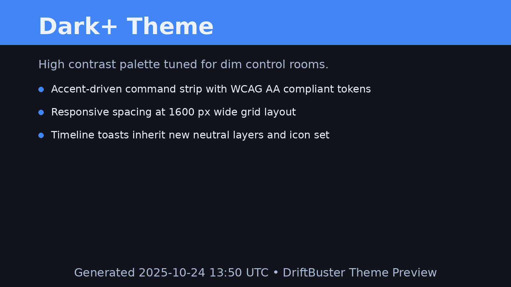
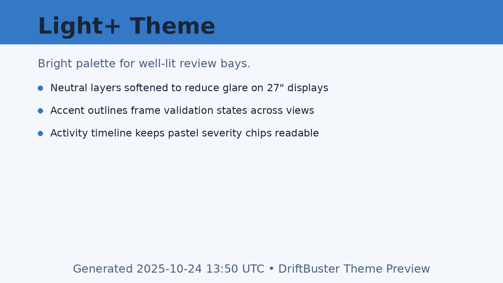

# DriftBuster Windows GUI Guide

This guide explains the capabilities, layout, and operational details of the Avalonia-based Windows shell shipped in `gui/DriftBuster.Gui`.

## 1. Overview
- **Purpose:** Provide a Windows-first experience for building diff plans and running hunt scans powered by the new .NET backend.
- **Architecture:** Avalonia (net8.0) desktop app backed by the shared `DriftBuster.Backend` library used by the PowerShell module.
- **Audience:** Analysts validating configuration drift manually, as well as developers exercising the core engine without the CLI.

## 2. Prerequisites
| Dependency | Notes |
|------------|-------|
| .NET SDK 8.0.x | Required to restore, run, and publish the GUI. |
| DriftBuster repo checkout | Required for fixtures and sample data referenced by the UI. |
| Optional editor tooling | JetBrains Rider, VS Code + Avalonia extension, or equivalent for XAML previews. |
| Microsoft Edge WebView2 Evergreen Runtime | Bundle the offline installer alongside portable/self-contained builds; confirm version recorded in `artifacts/gui-packaging/`. |

## 3. Launching the GUI
1. Ensure prerequisites are installed (`dotnet --list-sdks`, `python --version`).
2. Restore + build: `dotnet restore gui/DriftBuster.Gui/DriftBuster.Gui.csproj` then `dotnet build -c Debug gui/DriftBuster.Gui/DriftBuster.Gui.csproj`.
3. Run: `dotnet run --project gui/DriftBuster.Gui/DriftBuster.Gui.csproj`.
4. The “DrB DriftBuster” window opens with Diff view selected by default. The compact header presents the DrB badge, navigation summary, a live backend health dot with **Check core**, and a **Theme** selector (Dark+/Light+). A pillbox banner beneath the header shows the current view context and shortcuts.
5. Demo data is bundled with the app under a `Samples/` directory in the output folder.
   See `docs/DEMO.md` for a guided walkthrough using these files.
6. Registry scan results collected by the offline runner (JSON under `data/<alias>/registry_scan.json`)
   are displayed alongside file-based findings when present.

## 4. Layout Walkthrough
- **Header strip:** DrB badge + title stack, navigation toggle group (Diff / Hunt / Profiles / Multi-server), backend health indicator with **Check core**, a **Theme** dropdown (Dark+/Light+), and a **Ping core** shortcut. Status messages from the active view flow into the headline banner so you can see scan progress even while switching tabs. Contextual toast notifications appear in the top-right overlay; each toast exposes copy actions for quick sharing of error details.
- **Diff view:** Build diff plans from multiple snapshots. Primary action uses accent fill; secondary actions use outline style. Includes validation, plan/metadata cards, raw JSON expander, and copy control.
- **Hunt view:** Targets directories/files, runs the hunt pipeline, and displays results as cards with rule metadata, counts, and status messaging.
- **Multi-server view:** Configure up to six hosts, validate roots, and orchestrate runs. The refreshed layout moves host management, execution controls, and the activity audit feed into balanced columns, so you can compare hosts without scrolling. Toasts surface scan status (success, attention, failure) and each timeline card exposes copy shortcuts for rapid sharing.

## Themes

- **Palette catalog:** `gui/DriftBuster.Gui/Assets/Styles/Theme.axaml` now exposes `Palette.DarkPlus` and `Palette.LightPlus` resource dictionaries. Each dictionary defines the `Color.*` and `Brush.*` tokens consumed throughout the GUI so palette updates remain isolated to a single file.
- **Migration defaults:** Legacy callers that rely on `Color.Accent`, `Brush.Surface`, and related keys continue to resolve without change. The base resources still point at the Dark+ palette until the selector applies a new option, preventing regressions for cached control templates and custom styles.
- **Runtime selection:** `MainWindowViewModel` binds the header dropdown to these palette entries. Selecting an option updates `Application.Current.RequestedThemeVariant` and rewrites the shared color/brush tokens so view refreshes pick up the new palette immediately.
- **Extending palettes:** To add additional themes, clone the structure used by `Palette.DarkPlus`, register a new `ThemeOption` in `ApplicationThemeRuntime`, and update the documentation matrix above. Keep the `Theme.DefaultPaletteId` resource in sync with the intended startup palette so migrations stay deterministic.

The captures above follow the asset naming convention documented in `docs/ux-refresh.md#theme-capture-manifest`. Reuse them in release material whenever the palettes change, and regenerate fresh captures after significant visual adjustments to keep the manifest traceable.

## Avalonia 11.2 Migration Notes

- **Release build recipe:** Run `dotnet build -c Release gui/DriftBuster.Gui/DriftBuster.Gui.csproj` to capture the Avalonia 11.2 output. Store the publish folder and the generated `DriftBuster.Gui.*.dll` hashes under `artifacts/builds/avalonia-11-2/` so regression reviewers can diff binaries against earlier builds.
- **Headless validation:** Execute `dotnet test gui/DriftBuster.Gui.Tests/DriftBuster.Gui.Tests.csproj --filter DisplayClass=ResultsCatalog` (or the full suite) immediately after rebuilding. The tests assert the updated sort pipeline and toast resource lookups so the 11.2 swap does not regress catalog ordering or notifications.
- **Manual smoke:** Launch the Release build once (`dotnet run -c Release --project gui/DriftBuster.Gui/DriftBuster.Gui.csproj`) and confirm: (1) catalog sort toggles update headers and persisted descriptors, (2) toast stacks resolve dark/light palette resources without missing icons, and (3) activity timeline export entries continue to log in the overflow tray.
- **Troubleshooting:** If the Release build fails to locate Avalonia resources, verify `gui/DriftBuster.Gui/Assets/Styles/Notifications.axaml` still references the migrated token names and re-run `dotnet clean` before rebuilding. Missing toast colours typically indicate stale ResourceDictionary caches from earlier versions.
- **Documentation trail:** Cross-reference the migration summary in `docs/ux-refresh.md#avalonia-112-migration-follow-up` and note the GUI release entry guidance in `docs/release-notes.md#avalonia-112-results-catalog-alignment` when publishing notes.

## 5. Diff Planner Details
### Inputs & Validation
- Use the **Browse** buttons beside each textbox to pick the left/right file.
- Inline messages (in red) surface when a path is missing or invalid.
- The **Build Plan** button stays disabled while validation fails or a request is running.

### Execution & Results
- Clicking **Build Plan** triggers an async request to the backend.
- While running, a progress bar animates and the button remains disabled.
- On success:
  - **Plan cards** list before/after snapshots, content type, labels, masks, and context lines.
  - **Metadata cards** reflect resolved paths and diff settings.
  - **Raw JSON** expander contains the untouched backend payload.
  - **Copy raw JSON** copies the payload for downstream tooling or manual inspection.
- Errors (e.g., missing files, permission issues) bubble into the red message banner.

### JSON payload schema
- The **Raw JSON** expander mirrors the backend response returned by `DriftbusterBackend.BuildDiffPlanAsync`. The payload is a
  single object with the following shape:
  - `versions`: ordered list of absolute or relative file paths exactly as submitted to the backend.
  - `comparisons`: array of comparisons, each containing:
    - `from` / `to`: resolved file names displayed in plan cards.
    - `plan`: serialized content including `before`, `after`, `content_type`, labels, `mask_tokens`, `placeholder`, and
      `context_lines`.
    - `metadata`: source file paths (`left_path`, `right_path`), the resolved `content_type`, and the enforced `context_lines`.
- The **Sanitized JSON** toggle emits the digest-only summary that the GUI stores in MRU entries. Sanitized payloads always
  exclude raw file contents and instead provide:
  - `generated_at`: UTC timestamp recorded when the diff ran.
  - `versions`: file names with directory information stripped.
  - `comparison_count`: convenience counter for paging bulk comparisons.
  - `comparisons[]`: each entry includes `plan` metadata (labels, mask tokens, placeholder, context lines), `metadata`
    (content type plus redacted path names), and a `summary` block exposing `before_digest`, `after_digest`, `diff_digest`,
    and line statistics (`before_lines`, `after_lines`, `added_lines`, `removed_lines`, `changed_lines`).
- Sanitized payloads are the only variant persisted to disk; MRU entries store the `sanitized_summary.json` format for replay
  without risking sensitive data.
- Redacted samples for both payloads live under `artifacts/samples/diff-planner/`:
  - `raw_payload.json` demonstrates the direct backend contract.
  - `sanitized_summary.json` shows the MRU-safe structure with digests and counts.

### MRU replay workflow
- Open the **Recent plans** dropdown in the diff planner header to list the most recent sanitized payloads (capped to ten).
- Selecting an item restores the plan inputs, sanitised metadata cards, and summary digests without rehydrating raw file
  contents.
- Each MRU entry includes the generated timestamp, baseline alias, and comparison count so analysts can confirm provenance
  before replaying a plan.
- Use **Manage saved plans…** to purge entries you no longer need. The dialog exposes the cache root resolved via
  `DriftbusterPaths.GetCacheDirectory("diff-planner")` so you can audit or delete payloads outside the GUI when required.
- MRU persistence never writes raw payloads to disk—only the sanitized summary described above. If validation detects an
  unsanitized payload, the GUI logs a structured rejection event (see `DiffViewModel` telemetry) and refuses to cache it.

### Sanitised screenshot capture
- When documenting MRU workflows, launch the GUI with the sanitized fixtures under `artifacts/samples/diff-planner/` to ensure
  no raw secrets appear in the UI.
- Capture screenshots after toggling **Sanitized JSON** so the diff panes render digest fields instead of file contents. Confirm
  the footer banner notes "Sanitized summary" before taking the capture.
- Store captures in `docs/assets/diff-planner/` using the naming pattern `YYYYMMDD-mru-<theme>-<resolution>.png` and log each
  addition in `docs/ux-refresh.md#diff-planner-mru`.
- Mask any lingering filesystem paths or operator names by overlaying solid rectangles before committing assets. Re-run the
  capture if masking would obscure key UI elements.

## 6. Hunt View Details
### Inputs
- **Target** accepts either a directory or single file. The Browse button opens a folder picker first, falling back to file selection.
- **Filter** (optional) applies a case-insensitive substring filter to result excerpts.
- Validation ensures the path exists before enabling the **Scan** button.

### Execution & Results
- A progress bar appears during scans; results persist until the next run.
- **Status banner** reports success (hit count) or “No matches found”.
- **Findings** are shown as cards that surface rule name/description, token badges, path, line number, and a trimmed excerpt.
- Hover tooltips provide full text when truncated.
- Raw JSON is available in the expander for exporting or analysis.

## 7. Multi-server View Details
### Host Configuration
- Host cards now render inside a responsive grid that fits 1280–1920 px widths without horizontal scrolling. Cards stretch to fill available space while keeping a minimum width, so you can scan labels, scopes, and roots side by side.
- Each card exposes a `ValidationSummary` tooltip and automation name that narrates the current root status (ready, pending validation, or needs attention) for screen readers.
- Keyboard users get high-contrast focus outlines on buttons, toggles, combo boxes, and root text boxes; the Run/Cancel strip also exposes access keys (`Alt+R`, `Alt+M`, `Alt+C`).
- Drag-and-drop host cards to reorder execution priority. The baseline preference and command ordering update in-place, and the new order is captured with the session snapshot.

### Root Validation & Persistence
- Switching a server to **Custom roots** keeps the validation summary live while you type. Duplicate or relative paths flag the card immediately, and summaries stay cached even when the card loses focus.
- Session saves now persist the active catalog sort descriptor, catalog filters, timeline filter, selected view (setup/results/drilldown), and root ordering so reloading a session restores the same working state.
- Font preload guardrail: `App.EnsureFontResources` seeds the `fonts:SystemFonts` alias dictionary during `BuildAvaloniaApp()`, so Release/Debug headless runs hydrate Inter before the multi-server view instantiates catalog headers or guidance text.

#### Persistence walkthrough
1. Click **Save session** after a successful multi-server run. The awaitable `SessionCacheService` writes the snapshot to `%LOCALAPPDATA%/DriftBuster/sessions/multi-server.json` (or the `$XDG_DATA_HOME` equivalent) while recording migration counters.
2. Relaunch the GUI; `ServerSelectionViewModel` loads the snapshot, reapplies host enablement, restores catalog/drilldown/timeline state, and logs a **Loaded saved session** activity entry summarising the number of restored servers.
3. Trigger **Run missing only** to validate the restored session. Cached hosts remain in **succeeded** state, while active plans append fresh activity telemetry without losing the restored context.

### Catalog & Drilldown Enhancements
- Catalog columns support click-to-sort with visual indicators; the current sort mode is cached alongside server state.
- Drilldown headers now surface format, baseline host, drift count, and provenance in a metadata strip for quick triage.
- A dedicated **Copy JSON** action copies the sanitised export payload to the clipboard without triggering a file save, mirroring the HTML/JSON export options.
- The execution summary grid exposes a **View drilldown** shortcut per host so analysts can jump into the latest drift snapshot without leaving the setup surface.

### Notifications & Timeline
- Toast alerts now surface in a compact stack with at most three visible at once; additional messages collapse into an overflow tray so long-running scans don't flood the viewport.
- Toast styling now reads Avalonia 11.2 theme dictionaries directly: override `Brush.Toast.*` or `Toast.Icon.*` resources under `ThemeVariant.Dark` / `ThemeVariant.Light` to tailor per-theme palettes without touching the converters.
- Timeline filters include **All**, **Errors**, **Warnings**, and **Exports**, and the chosen filter plus the last opened drilldown host persist with the rest of the multi-server session.
- Clipboard/export actions write to the timeline with the new **Exports** filter so analysts can isolate delivery events quickly.

### Virtualization heuristics & fallback toggle
- The server cards, activity feed, and results catalog all read a shared `PerformanceProfile` that flips between the virtualised `ItemsRepeater` layout and the non-virtualised fallback when host counts are low. The default threshold is **400** entries, keeping memory usage predictable without penalising small scans.
- Operators can raise or lower the threshold before launching the GUI by exporting `DRIFTBUSTER_GUI_VIRTUALIZATION_THRESHOLD=<count>` (PowerShell: `setx DRIFTBUSTER_GUI_VIRTUALIZATION_THRESHOLD 600` then restart the shell) on machines that regularly plan against hundreds of hosts.
- Low-memory hosts can force the simpler non-virtualised list by setting `DRIFTBUSTER_GUI_FORCE_VIRTUALIZATION=false` before launch. The override applies immediately across all virtualised surfaces, swapping in the existing `ItemsControl` fallback that avoids retaining recycled item containers.
- Set `DRIFTBUSTER_GUI_FORCE_VIRTUALIZATION=true` to keep virtualization enabled even for tiny host counts when you want to minimise viewport footprint or avoid re-layout churn after toggling filters.
- Overrides are read on startup; update the environment variable, restart the shell, then relaunch the GUI to apply changes. Logged heuristics and the active override value appear in the performance smoke artefact under `artifacts/perf/` for future audits.

## Performance

- Run `python scripts/perf_diagnostics.py` to capture the lightweight perf-smoke suite (`Category=PerfSmoke`) and export a JSON baseline to `artifacts/perf/baseline.json`.
- The export records the executed `dotnet test` command, outcomes, and durations for each perf case. Successful runs keep both checks under **60 ms** (environment override in ~2 ms, toast burst harness in ~50 ms) so dispatcher batching remains intact.
- The JSON payload also includes a virtualization projection table. Counts below the default **400** threshold stay on the simpler list layout, while synthetic scenarios at **400+** flip to virtualisation; precomputed matrices for `force=true` / `force=false` demonstrate how overrides change that behaviour.
- Multi-server fixture statistics (10 hosts / 37 config files in the bundled sample) live alongside the perf data, helping you estimate whether upcoming runs will trip the virtualization threshold.
- Re-run the script after tweaking thresholds or toast batching logic and compare the resulting `captured_at_utc` stamps plus projections to confirm behavioural drift before shipping changes.

## 8. Backend Bridge
- `DriftbusterService` instantiates the shared `DriftbusterBackend` class and executes diff, hunt, and run-profile operations in-process.
- Diff calls load file contents, build the same JSON payload exposed to the UI, and reuse the shared models for plan metadata.
- Hunt scans walk the filesystem locally, apply the default rule set, and surface filtered hits to the view models.
- Run profile actions persist JSON definitions, copy snapshot files, and emit metadata using the shared library helpers.
- Multi-server orchestration shells out to `python -m driftbuster.multi_server`, streams per-host progress back into toasts and the activity timeline, and persists cached diffs under the DriftBuster data root (e.g. `%LOCALAPPDATA%/DriftBuster/cache/diffs/`, `$XDG_DATA_HOME/DriftBuster/cache/diffs/`).
- All work runs asynchronously on background tasks so the UI stays responsive; errors surface through the existing status banners.

## 9. Packaging Options
- Default release builds produce an installer:
  - `python scripts/release_build.py --release-notes notes/releases/<semver>.md --installer-rid win-x64`
  - Installer artifacts: `artifacts/velopack/releases/<rid>`.
- Direct Velopack usage:
  - `dotnet tool restore`
  - `scripts/build_velopack_release.sh --version <semver> --release-notes notes/releases/<semver>.md [--rid win-x64]`
  - Use `--channel` (prereleases) and `--pack-id` (bundle id) as needed.
- Manual portable publish (for quick local runs):
  - `dotnet publish gui/DriftBuster.Gui/DriftBuster.Gui.csproj -c Release -r win-x64 --self-contained false /p:PublishSingleFile=true`
- Before packaging, sync versions: `python scripts/sync_versions.py`.

### Packaging prerequisites checklist

| Step | Purpose |
|------|---------|
| Capture current commit hash (`git rev-parse HEAD > artifacts/gui-packaging/commit.txt`). | Tie installer evidence back to source. |
| Stage WebView2 offline installer next to publish output. | Satisfy Evergreen redistribution requirements for offline installs. |
| Generate SHA256 manifest for every staged file. | Enable downstream integrity verification without internet access; mirror outputs listed in `docs/windows-gui-notes.md#evidence-index-a196`. |
| Copy updated `NOTICE` directory into the bundle. | Keep licence obligations intact across packaging flavours. |
| Log install/uninstall transcript to `artifacts/gui-packaging/publish-<flavour>.log` (or a dedicated logs folder) and archive alongside hashes. | Provide reproducible evidence for legal and security reviews. |

## 10. Manual Smoke Checklist
- Located at `notes/checklists/gui-smoke.md`.
- Covers ping, diff, hunt, error handling, and verifying backend shutdown after closing the window.
- Record date/operator each time the checklist is executed.

## 11. Automated & Headless Tests
- UI automation lives in `gui/DriftBuster.Gui.Tests/Ui` and complementary view-model suites under `gui/DriftBuster.Gui.Tests/ViewModels`. Headless UI tests are attributed with `[AvaloniaFact]`, ensuring each case runs on the Avalonia dispatcher (navigation, drilldown exports, hunt flows, converters, session cache, and theme toggles).
- `HeadlessFixture` calls `Program.EnsureHeadless(...)`, which guards against duplicate `AppBuilder.Setup` calls in repeated test execution.

### Headless bootstrap
  - `Program.BuildAvaloniaApp()` preloads the `fonts:SystemFonts` resource so the Avalonia headless pipeline always has a populated `ConcurrentDictionary<string, FontFamily>` including the alias entry consumed by `FontManager.SystemFonts`.
  - `Program.EnsureHeadless(...)` binds `HeadlessFontManagerProxy` through `HeadlessFontBootstrapper` so Avalonia's `IFontManagerImpl` always resolves Inter with synchronous glyph loading. The proxy normalises aliases such as `fonts:SystemFonts`, extends the installed family list, and keeps glyph requests deterministic for smoke tests. Call sites worth preserving:
    - `App.EnsureFontResources` seeds the alias dictionary consumed by Avalonia controls via `FontManager.SystemFonts`.
    - `HeadlessFixture` verifies `FontManager.Current` exposes Inter as the default family and resolves glyphs for both Inter and the alias, protecting glyph paths used by text controls and dialogs.
    - `HeadlessBootstrapperSmokeTests` assert the locator binding and glyph creation path so regressions in the proxy surface before full suites run.
  - Keep this preload intact when editing the bootstrapper so fixtures never hit the `KeyNotFoundException` observed before the guardrails landed.

### FontManager regression playbook
- **Purpose:** Confirm `fonts:SystemFonts` and `fonts:SystemFonts#Inter` stay resolvable in both Release and Debug builds so headless smoke tests mirror production.
- **Targeted tests:**
  1. `dotnet test gui/DriftBuster.Gui.Tests/DriftBuster.Gui.Tests.csproj -c Release --filter FullyQualifiedName~HeadlessBootstrapperSmokeTests.EnsureHeadless_release_mode_exposes_inter_alias_through_system_fonts`
  2. `dotnet test gui/DriftBuster.Gui.Tests/DriftBuster.Gui.Tests.csproj --filter FullyQualifiedName~HeadlessFixture`
- **Expected signals:** The smoke test asserts the `fonts:SystemFonts` resource exposes the Inter alias keys consumed by `FontManager.SystemFonts`, and `FontManager.Current.TryGetGlyphTypeface("fonts:SystemFonts#Inter")` succeeds; the fixture cross-checks `FontManagerOptions.DefaultFamilyName` and fallback ordering against `FontManager.Current`.
- **Failure triage:** If either command fails, inspect `artifacts/logs/fontmanager-regression.txt` for the captured stack trace and rerun `Program.EnsureHeadless` instrumentation to verify the proxy registered its aliases.
- Run targeted suites via tmux: `tmux new -d -s codexcli-ui 'cd /github/repos/DriftBuster && dotnet test gui/DriftBuster.Gui.Tests/DriftBuster.Gui.Tests.csproj --filter "FullyQualifiedName~DiffViewTests"'`.
- Full coverage expectations:
  - Debug: `dotnet test gui/DriftBuster.Gui.Tests/DriftBuster.Gui.Tests.csproj -p:Threshold=90 -p:ThresholdType=line -p:ThresholdStat=total`
  - Release: `dotnet test gui/DriftBuster.Gui.Tests/DriftBuster.Gui.Tests.csproj -c Release -p:Threshold=90 -p:ThresholdType=line -p:ThresholdStat=total`
  - XAML compilation gate: `dotnet test gui/DriftBuster.Gui.Tests/DriftBuster.Gui.Tests.csproj -p:EnableAvaloniaXamlCompilation=true`
- Diagnostic harness: set `AVALONIA_INSPECT=1` and run `--filter FullyQualifiedName=DriftBuster.Gui.Tests.Ui.AvaloniaSetupInspection.LogSetupState` to capture resource/style registration in `artifacts/codexcli-inspect.log`.

## 12. Troubleshooting
| Symptom | Suggested Checks |
|---------|-----------------|
| “Backend closed unexpectedly” | Run the GUI from a console and inspect logs; verify the selected files are accessible. |
| Validation won’t clear | Confirm file/directory exists and is accessible; refresh the path using Browse. |
| Empty hunt results | Check filter string, increase rule coverage, or drop filter to view raw hits. |
| Clipboard not working | Ensure the app is running in a desktop session (clipboard APIs require a real user session). Use the activity timeline’s copy buttons to verify clipboard access quickly. |
| Packaged build fails to launch WebView2 | Confirm the offline Evergreen installer ran successfully and the recorded runtime version matches the hash manifest; reinstall using `/silent /install` and capture the updated log. |
| Hash verification mismatch | Recompute SHA256 hashes for the staged bundle and confirm the manifest includes every file distributed to operators; regenerate the manifest before retrying install. |
| MSIX refuses to install (certificate error) | Verify the signing certificate thumbprint matches the value logged in `notes/checklists/legal-review.md`; import the certificate into `Trusted People` on the VM before rerunning the install. |

## 13. Extensibility Pointers
- Extend `Driftbuster.Backend` with new helpers, then wire them into both the GUI service and PowerShell module.
- New view models should expose observable collections + status fields similar to Diff/Hunt pattern.

For deeper implementation notes, refer to `docs/windows-gui-notes.md` (engineering focus) and `notes/dev-host-prep.md` (host setup log).

## 14. PowerShell module
- Imports live under `cli/DriftBuster.PowerShell`. Use the module when running backend commands from Windows shells without the GUI.
- The module loads `DriftBuster.Backend.dll` through the shared cache directory resolved by `DriftbusterPaths.GetCacheDirectory`.
- Initialise the module with the following sequence to guarantee a published backend and JSON-aligned outputs:
  1. Publish the backend once per build: `dotnet publish gui/DriftBuster.Backend/DriftBuster.Backend.csproj -c Debug -o gui/DriftBuster.Backend/bin/Debug/published`.
  2. Import the module: `pwsh -NoLogo -NoProfile -Command "Import-Module ./cli/DriftBuster.PowerShell/DriftBuster.psm1 -Force"`.
  3. Verify connectivity and schema: `Test-DriftBusterPing` (returns `{ status = "pong" }`), `Invoke-DriftBusterDiff -Left baseline.json -Right release.json`, and `Invoke-DriftBusterRunProfile -Profile <profile.json> -BaseDir . -NoSave -Raw`.
  4. When validating packaging, run `pwsh ./cli/DriftBuster.PowerShell.Tests/Invoke-ModuleTests.ps1` to execute the Pester suite and capture an NUnit XML report under `artifacts/powershell/tests/`.
- Package the module for distribution using `pwsh ./scripts/package_powershell_module.ps1 -Configuration Release`. The script copies the compiled backend into a temporary staging area, produces `artifacts/powershell/releases/DriftBuster.PowerShell-<version>.zip`, and writes a matching `.sha256` checksum file in the same directory.
- Confirm the checksum before publishing: `Get-FileHash artifacts/powershell/releases/DriftBuster.PowerShell-<version>.zip -Algorithm SHA256` should match the recorded hash.

### Troubleshooting
| Symptom | Suggested Checks |
|---------|-----------------|
| Import fails with `DriftBusterBackendMissing`. | Publish the backend: `dotnet publish gui/DriftBuster.Backend/DriftBuster.Backend.csproj -c Debug -o gui/DriftBuster.Backend/bin/Debug/published`, then re-import the module or copy the resulting `DriftBuster.Backend.dll` next to `DriftBuster.psm1`. Confirm the cache directory contains the DLL afterwards. |
